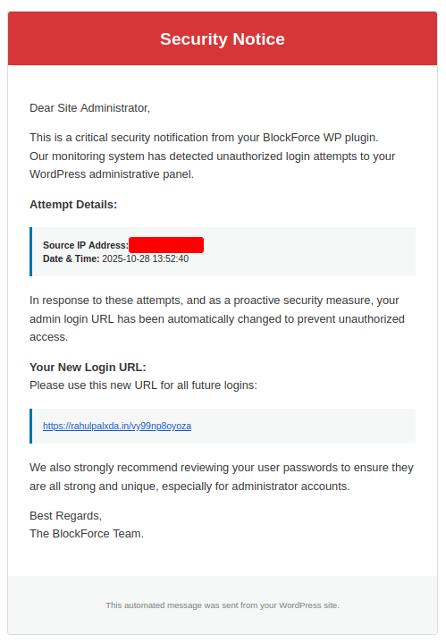

# BlockForce WP

A lightweight WordPress security plugin that protects your login page from brute-force attacks through IP blocking and automatic login URL changes.

## Features

- **IP Blocking**: Temporarily blocks malicious IPs after failed login attempts
- **Auto URL Change**: Automatically moves wp-login.php to a secret URL when attacks are detected
- **Email Alerts**: Sends notifications with the new login URL and attacker details
- **Login Error Obfuscation**: Prevents username enumeration
- **Dashboard Widget**: Real-time security statistics on your WordPress dashboard
- **Health Check Integration**: Validates configuration through WordPress Site Health

## Installation

### Method 1: Download from GitHub

1. Go to the [GitHub repository](https://github.com/RahulPalXDA/BlockForce-WP)
2. Click the green "Code" button
3. Select "Download ZIP"
4. Log in to your WordPress admin panel
5. Navigate to Plugins > Add New
6. Click "Upload Plugin" at the top
7. Choose the downloaded ZIP file
8. Click "Install Now"
9. Click "Activate Plugin"
10. Configure settings at Settings > BlockForce WP

### Method 2: Manual Installation

1. Download and extract the plugin ZIP file
2. Upload the `blockforce-wp` folder to `/wp-content/plugins/`
3. Activate the plugin through the 'Plugins' menu in WordPress
4. Configure settings at Settings > BlockForce WP

## Configuration

Navigate to Settings > BlockForce WP to configure:

- **Maximum Failed Attempts**: Number of failures before triggering protection (default: 2)
- **IP Block Duration**: How long to block an IP address (default: 120 seconds)
- **Attack Monitoring Window**: Time window for tracking persistent attacks (default: 7200 seconds)
- **IP Blocking**: Enable/disable temporary IP blocks
- **Auto URL Change**: Enable/disable automatic login URL changes
- **Alert Email**: Email address for security notifications

## How It Works

### IP Blocking (Fast Response)
- Blocks IPs that fail login X times within Y seconds
- Provides immediate protection against rapid attacks

### Login URL Change (Long-term Protection)
- Changes login URL when an IP accumulates X failures within Z seconds
- Stops persistent bot attacks by hiding the login page
- Only changes URL if email notification is sent successfully

## Requirements

- WordPress 5.0 or higher
- PHP 7.2 or higher

## License

MIT License - see LICENSE file for details

## Support

For issues and feature requests, please visit the GitHub repository.
